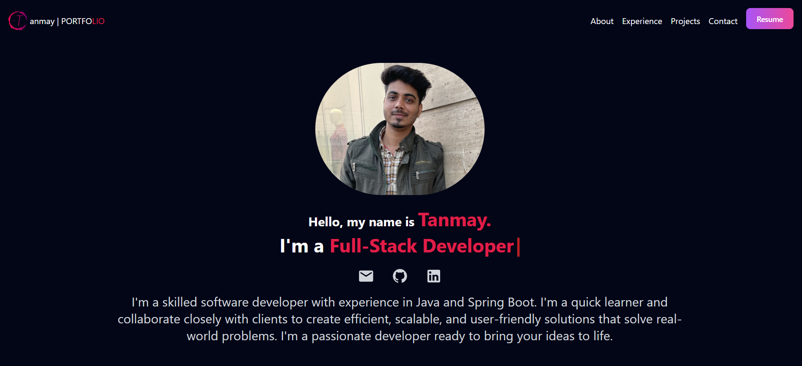
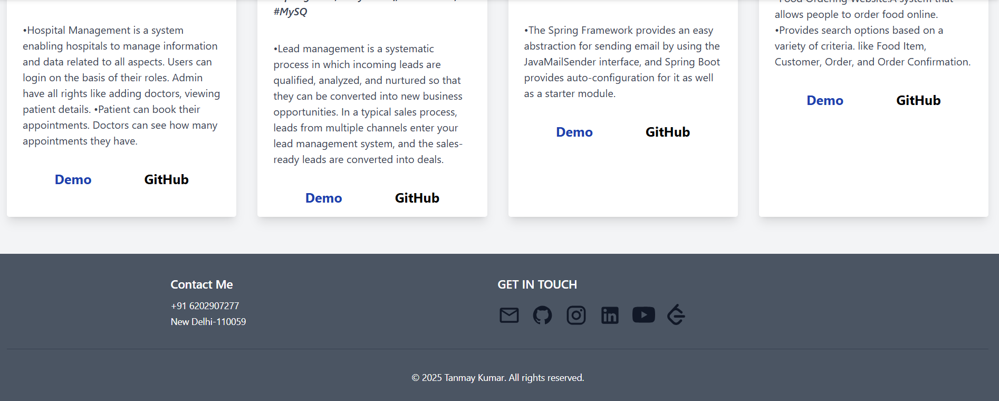
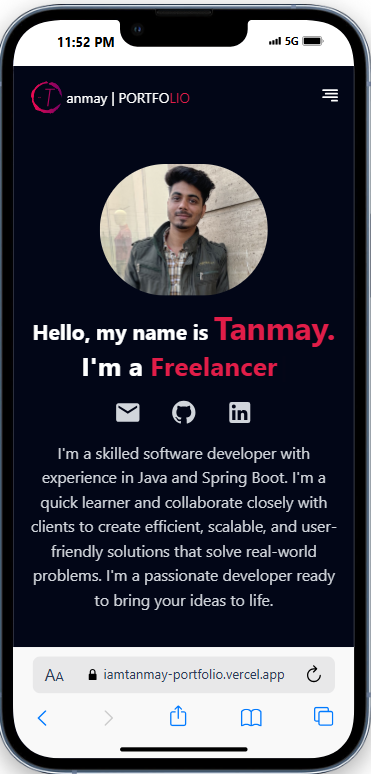
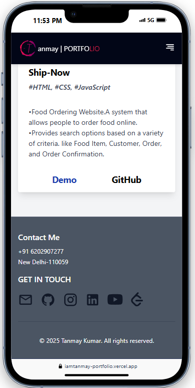
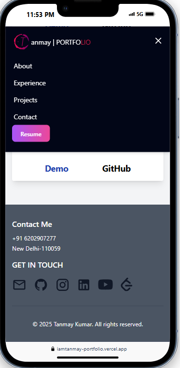

<h1 align="center">PORTFOLIO-DEMO</h1>

- This project is a Personal Portfolio Project. 
- Building this Web app with intention of learning creating portfolio and Learing React.

## 🚀 Features

- 🔹 Typing effect by the help of react-simple-typewriter
- 🔹 vertical line with animation in-out (react-vertical-timeline-component)

## 🏗️ Tech Stack

- ⚛ React - Frontend framework

- 🎨 Tailwind CSS (or your preferred CSS framework) - Styling

- 🛠 Vite/Webpack - Build tool

- 📌 react-simple-typewriter

## 📸 screenshot

<h1 align = "center">Desktop view</h1>
<table border="1">
  <thead>
    <tr>
      <th style="text-align:center;" >1</th>
      <th style="text-align:center;" >2</th>
    </tr>
  </thead>
  <tbody>
    <tr>
      <td></img></td>
      <td></img></td>
    </tr>
  </tbody>
</table>

<h1 align = "center">Mobile view</h1>
<table border="1" align = "center">
  <thead>
    <tr>
      <th style="text-align:center;" >1</th>
      <th style="text-align:center;" >2</th>
    </tr>
  </thead>
  <tbody>
    <tr>
      <td></img></td>
      <td></img></td>
    </tr>
  </tbody>
</table>
<table border="1" align = "center">
  <thead>
    <tr>
      <th style="text-align:center;" >3</th>
    </tr>
  </thead>
  <tbody>
    <tr>
      <td></img></td>
    </tr>
  </tbody>
</table>

## 📜 License

```
©️2024

This project is licensed under the MIT License.
```